# Assignment 1 Report

## Author: Soham Vaishnav
## Roll No.: 2022112002

### 2: K-Nearest Neighbors

#### Task 1: Data Visualisation
The spotify dataset contains 114000 data points with 20 features. The features look as follows:
| Feature Name | Data Type |
|---|---|
| track_id | string |
| artists | string | 
| album_name | string |
| track_name | string |
| popularity | float |
| duration_ms | float |
| explicit | bool |
| danceability | float |
| energy | float |
| key | int |
| loudness | float |
| mode | int |
| speechiness | float |
| acousticness | float |
| instrumentalness | float |
| liveliness | float |
| valence | float |
| tempo | float |
| time_signature | int |
| track_genre | string |

Since the task is to deploy KNN for predicting music genre, the last feature becomes the label set. For the other columns, the string ones can be either removed or encoded into some numeric form for them to be useable by the model. \\
For visualisation, I have plotted the numeric features. The individual figures can be seen in `./figure`. For the combined plots, refer to the following figures:
To add a figure in the README.md file, you can use the following markdown syntax:

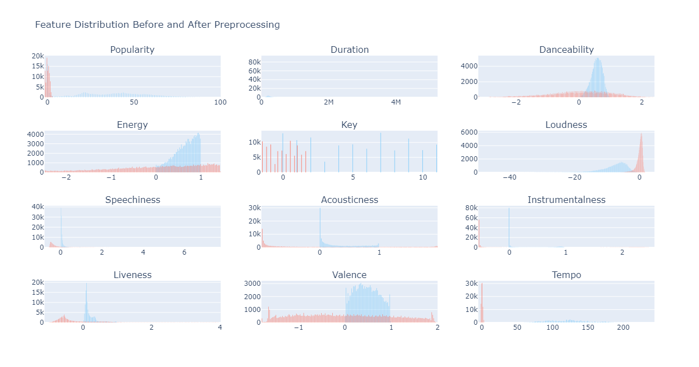

For some features like acousticness, instrumentalness, tempo and valence, after looking at the distribution, it felt better to represent them in the following manner as well:

| 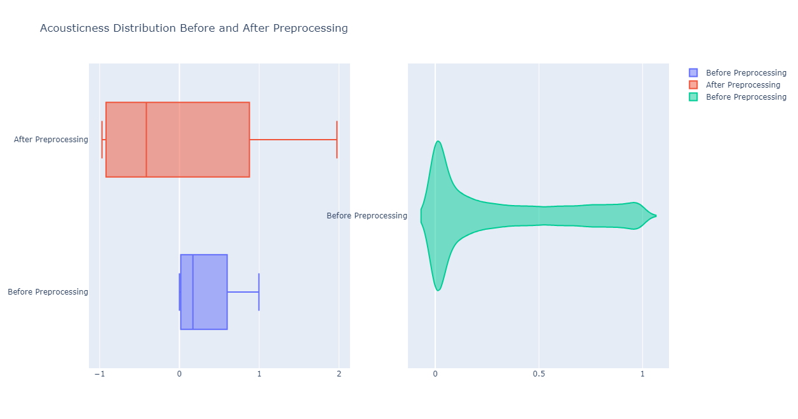 | 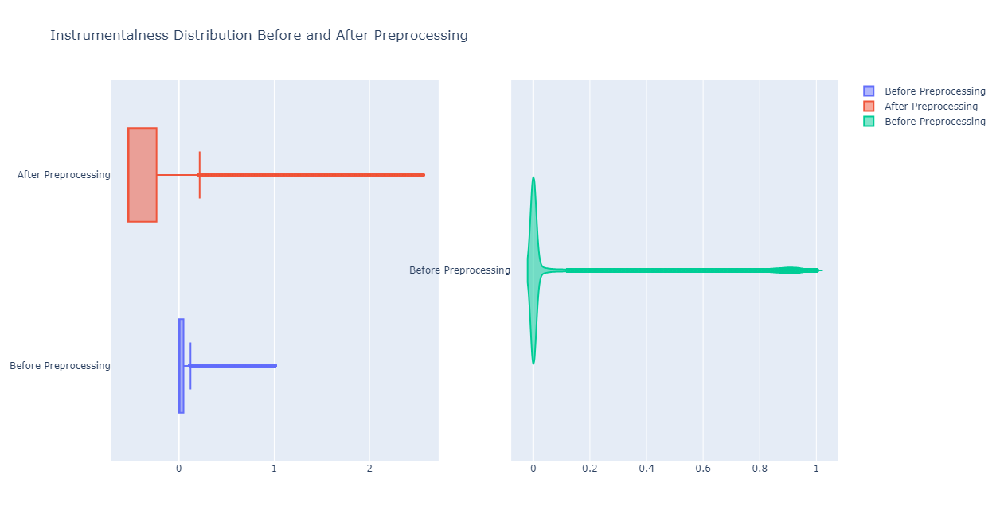 | 
|---|---|

| 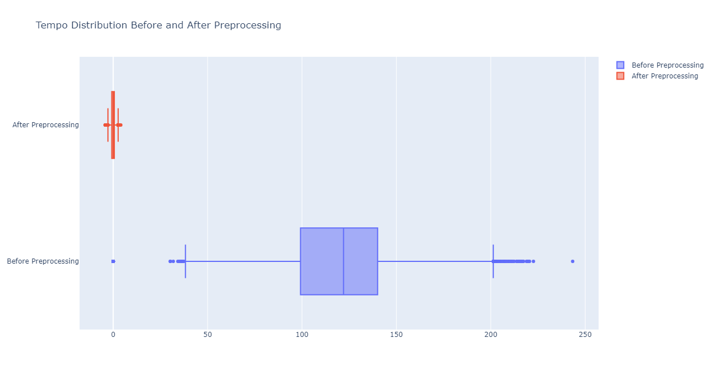 | 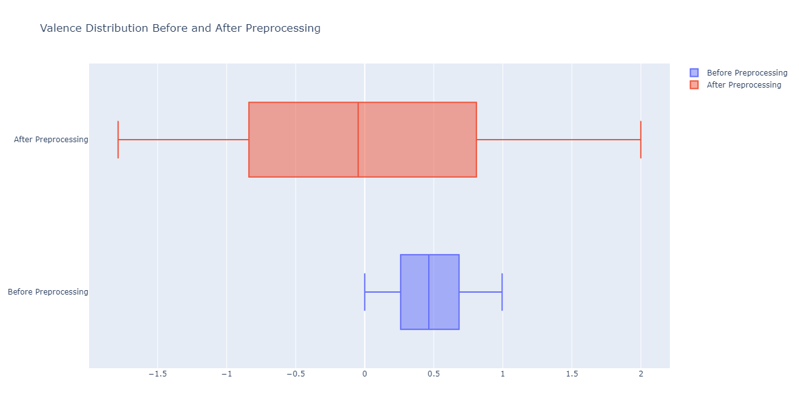 |
|---|---|

Here, we can clearly observe the effects of normalisation on the data (covered in the next section). \\
For the labels, I visualised their distribution using a histogram so as to give an idea about how to split the data into train, validation and test sets.

Some features which are binary in nature or have very less values that they can take are represented as follows:

| 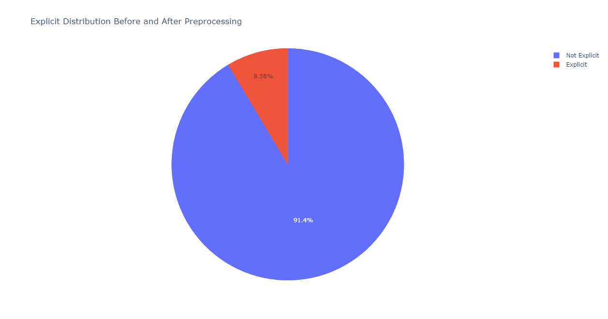 | 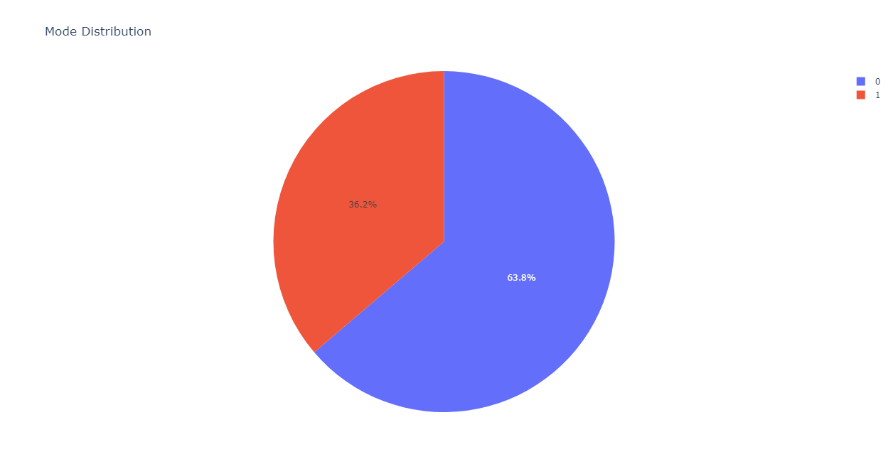 |
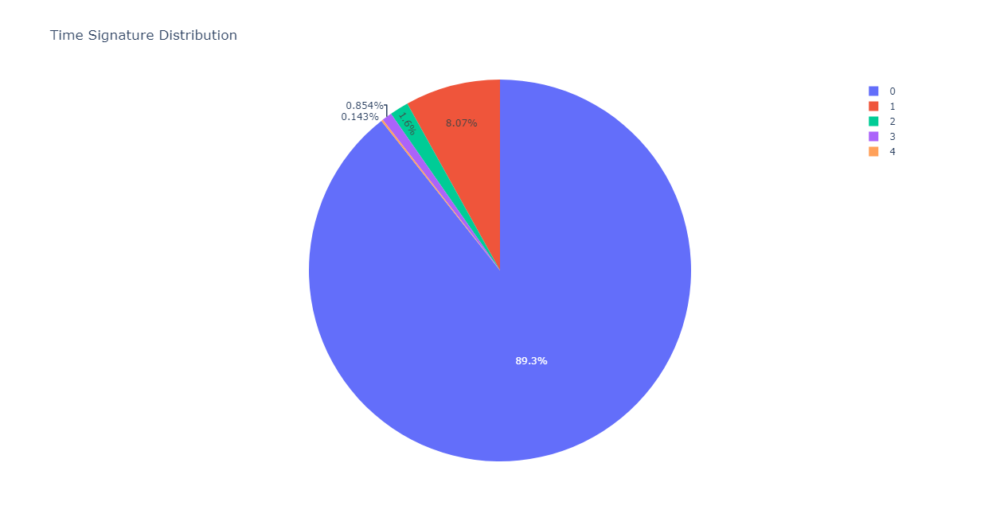
|---|---|---|

Initially, all the classes were equally distributed across the datapoints and thus it did not make sense to perform stratified sampling. But if we observe the data after preprocessing, it is clear that stratified sampling is required (covered in the next section). \\

Since, we had to visualise the correlation between various features, I felt it most appropriate to generate a pair plot between features over the labels so as to give an idea of how they all are related.

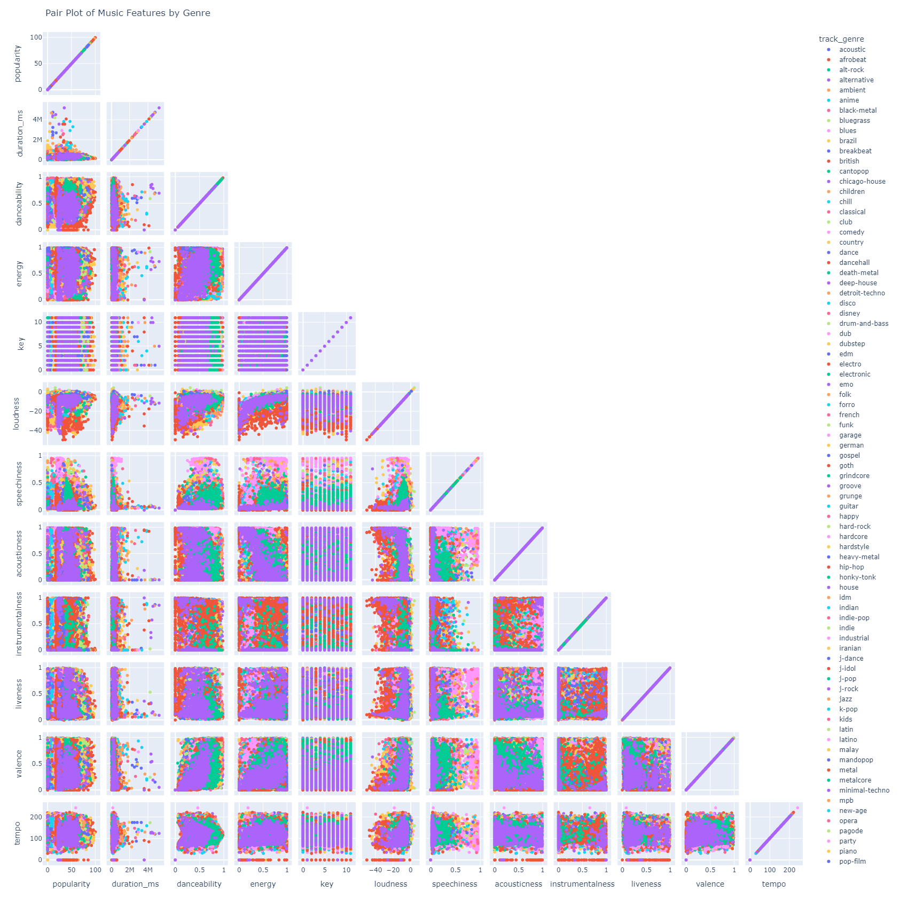

The pair plot is a great way of gaining insights into the dataset:
- Intuitively, since there are 114 classes (or labels) the plots are very congested
- There is no clear separation between any two classes for any pair of features and hence the model might not deliver great performance metrics
- Duration is a feature which by looking at the plot seems to be of least importance
- Since data is too closely packed in the feature space, **Manhattan Distance** will give better results than other metrics and **Cosine Similarity** will perform the worst

#### Task 2: KNN Implementation
Followed the structure mentioned in the doc. \
- Additionally, the class `KNN()` contains functions such as `DataSplitter()` and `DataNormaliser()` which have more to do with the model than with any data in particular. The reason for not putting the above functions in the `a1.py` is because if KNN has to be used later, these will be useful then and there. \
- `DataNormaliser()` along with another function in `a1.py` called `DataRefiner()` help in preprocessing of the data where they collectively remove the `null` and `NaN` values and also normalise the remaining numeric values.
- The class also has another function `FindDistance()` which makes use of the distance metric set by the user and computes the distance metric which can then be used for prediction purposes. All the operations in here are vectorised to promote temporal efficiency.
- Functions such as `SetNumNeighbors()`, `GetNumNeighbors()`, `SetDistMetric()` and `GetDistMetric()` serve in the purpose of easier access and setting of hyperparameters.
- `predict()` function iterates through the rows of distance metric and finds `argmax()` of labels corresponding to the nearest k points from the train set. It makes use of the performance metrics coded in the folder `.../performance_measures` inside `confusion_matrix.py` that help calculate accuracy, macro and micro precision, recall and f1_score. Predicted values and scores are returned.

#### Some add ons:
- I have added a function called `Word2Num()` inside `a1.py` which does the task of converting string features to some numerical form - generates embeddings for the strings.
    - The method that I have used here is based on the probability distribution of the strings with respect to the max occurance. Therefore, each string is given a value in the range `(0, 1)` where 1 will be given to the string which occurs the most. 
    - This allows me to sustain and visualise the effect that each string feature has/does not have on the determination of music genres.
    - Once converted, the strings - now numerals - are treated just like any other numeric feature and go through the same preprocessing tasks.

 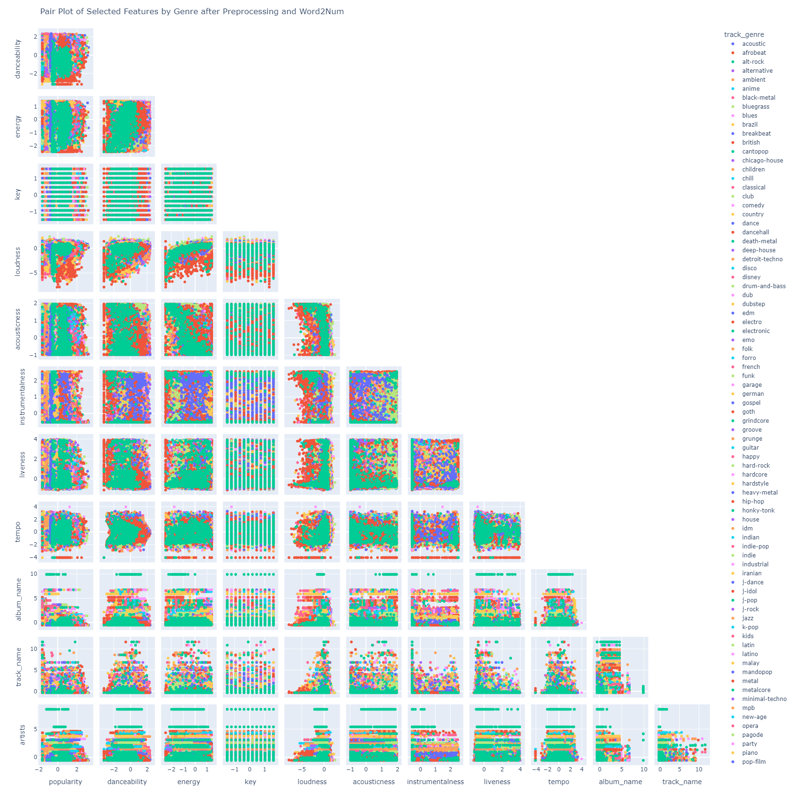
 We can observe that by visualising the correlation of the string features with other numeric features, the genres seem to be more *identifiable* due to slightly better scatter and some disjoint regions. The effects of this addition will also be visible in the model performance.

- Functions like `DataLoader()` and `DataWriter()` have also been written for keeping the code modular.

#### Task 3: Hyperparameter Tuning
- In concordance with our initial analysis during data visualisation, the best `{k, dist_metric}` pair for a train:valid:test split of `80:10:10` in terms of giving highest accuracy is `{k=15, dist_metric = l1}` with an accuracy on validation set of 36.88%. \
**Note**: The dataset used here is the one obtained after applying `Word2Num()` on the string features. In case of simply removing those columns, we get the same hyperparameter pair but giving an accuracy of 29.96%. This makes it evident that the string features do play a role in determining the genre.
- Top 10 `{k, dist_metric}` pairs that give the highest accuracy are as follows:

| rank | k | dist_metric | accuracy |
|---|---|---|---|
| 1 |  15 | l1 | 36.88 | 
| 2 | 35 | l1 | 36.32 | 
| 3 | 10 | l1 | 36.11 |
| 4 | 1 | l1 | 35.71 |
| 5 | 50 | l1 | 35.30 |
| 6 | 5 | l1 | 34.74 |
| 7 | 65 | l1 | 34.57 |
| 8 | 80 | l1 | 34.34 |
| 9 | 100 | l1 | 33.83 |
| 10 | 150 | l1 | 32.98 |

All the top performing hyperparameters are those with **Manhattan** distance metric and that is very much in line with how the data is scattered in the feature space. 
**Note**: All the metrics shown above are measured with no columns dropped. This analysis is done later.

- The k v/s accuracy plot for best pair of k and distance metric looks as follows:
NEED TO ENTER THE PLOT

- From the data visualisation we can say that dropping the string features affects the performance by margin of around 7%.
- I also tried by dropping columns such as `key`, `duration_min`, `time_signature`, `mode`, `popularity`, `energy` and `instrumentalness`, and their combinations for testing the model on the validation set to check their effect on the accuracy.
    - dropping `key`, `duration_min`, `time_signature` and `mode` gives better accuracy with an increase of around 2%
    - dropping features such as `popularity`, `energy` and `instrumentalness` vastly affects the accuracy, so much so that it dips by 12%! (Kind of expected as well)

#### Task 4: Optimisation
- My original model itsel is an optimised version of KNN because I tried to vectorise the code as much as possible in the first go itself. 
    - Vectorisation was most necessary in calculating distances and in predicting the labels where sorting and majority selection were involved.
    - `cosine` distance metric takes the most time out of the three distance metrics due to an additional matrix consisting of the norm of the train and validation/test sets.
- Following are the model stats:
    - Initial KNN - Vectorised version which took around 3 minutes for `predict()` function
    - Best KNN - Uses **k=15** and **l1** as distance metric takes similar time as the initial KNN
    - Most Optimised KNN - One major modification is that here I calculate the distance metrics for batches of the validation/test datasets which utilises numpy functions thereby quickening the process by around 1.5 minutes (here the time taken is 96.36 seconds)
    - SKLearn KNN - Using the same hyperparameters there is a drastic difference in the time taken for the model - only 17.93 seconds
-Plot for train dataset size v/s inference time

#### Spotify-2 Dataset
k = 15 and distance metric = l1
Metrics:
| Set | Accuracy | Precision_macro | Recall_macro | f1_macro |
|---|---|---|---|---|
| validate | 35 | l1 | 36.32 | |
| test | 10 | l1 | 36.11 | |

### 3: Linear Regression
The data `linreg.csv` was shuffled and split into train:validate:test sets in ratio 80:10:10. Following table highlights the metrics:
| Set | Std. Dev. | Variance |
|---|---|---|
| train | 0.57 | 0.33 | 
| validate | 0.62 | 0.31 | 
| test | 0.59 | 0.34 |

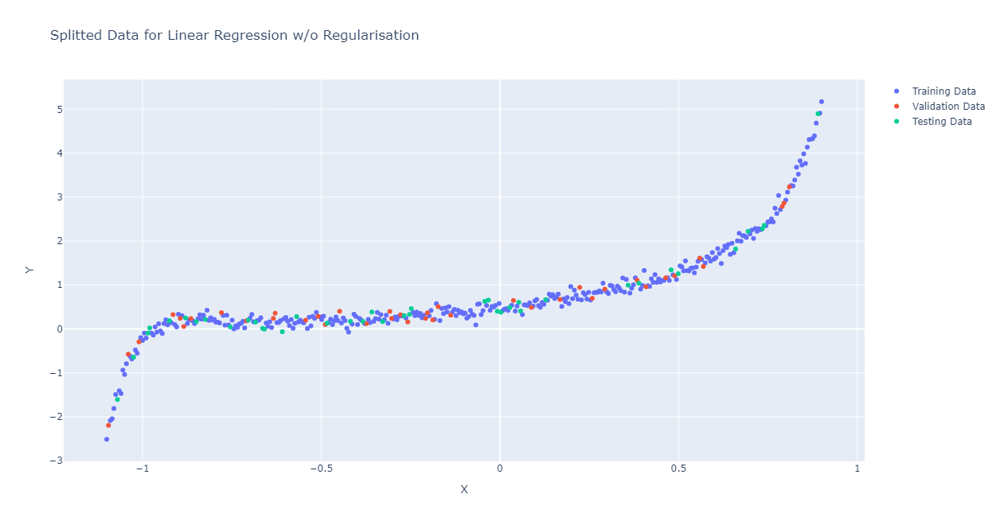

#### Implementation of Linear Regularisation Class
- Goes by the name `LinearRegularisation()` under the specified folder
- Contains helper functions like `SetDegree()`, `GetDegree()`, `SetLambda()`, `GetLambda()`, `SetLearningRate()` and `GetLearningRate()` for setting and accessing the hyperparameters for various operations
- Contains `train()` and `predict()` functions for finding the parameters and predicting the dependent variable
- Contains `DataSplitter()` specific to Linear Regularisation
- Contains `Transform2Poly()` which transforms the X variable to higher degrees used for regularisation and polynomial regression.

#### Degree 1
Obtained values of parameters: 
`beta = [0.903, 1.59]`
| Set | Std. Dev. | Variance | MSE |
|---|---|---|---|
| train |  0.57 | 0.33 | 113.46 | 
| test | 0.59 | 0.34 | 7.62 |

Plot for line of best fit:
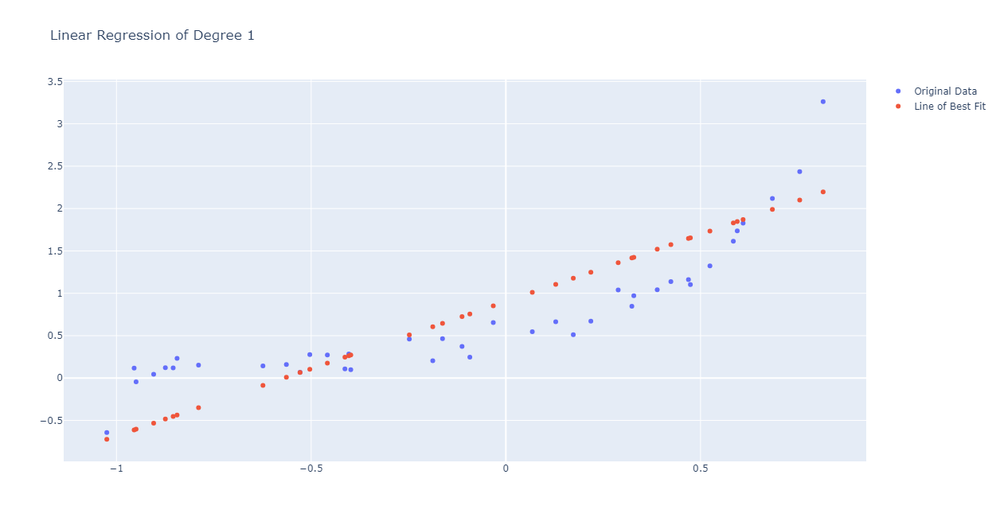

#### Degree > 1
Tabularising the outputs:
- For train set:
| k | Std. Dev. | Variance | MSE |
|---|---|---|---|
| 2 | 0.92 | 0.86 | 71.37 | 
| 3 | 1.0 | 1.01 | 27.44 |
| 4 | 1.04 | 1.09 | 22.90 | 
| 5 | 1.06 | 1.12 | 18.36 |
| 6 | 1.05 | 1.11 | 16.11 | 
| 7 | 1.09 | 1.20 | 11.38 |
| 10 | 1.03 | 1.06 | 7.82 | 
| 12 | 1.08 | 1.17 | 5.94 |

- For test set:
| k | Std. Dev. | Variance | MSE |
|---|---|---|---|
| 2 | 0.96 | 0.93 | 6.64 | 
| 3 | 1.01 | 1.02 | 3.99 |
| 4 | 0.89 | 0.80 | 11.50 | 
| 5 | 0.71 | 0.50 | 2.01 |
| 6 | 0.74 | 0.55 | 1.38 | 
| 7 | 0.86 | 0.74 | 1.55 |
| 10 | 1.16 | 1.34 | 0.90 | 
| 12 | 1.09 | 1.20 | 0.72 |

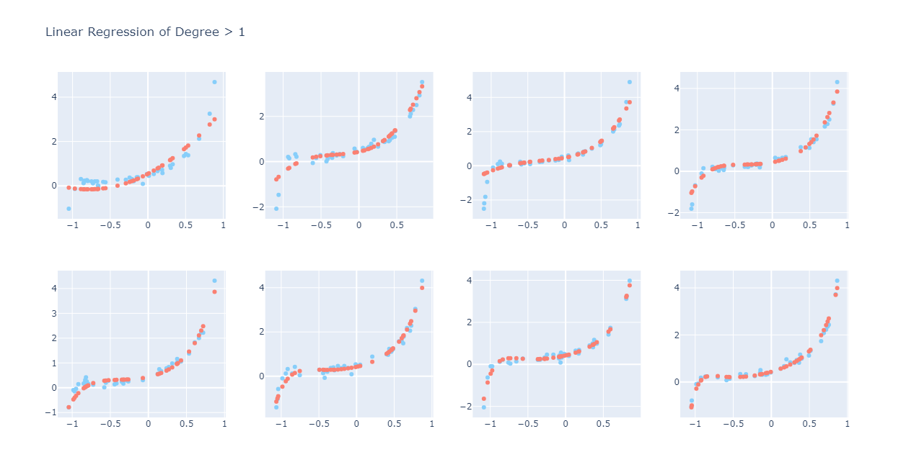
Here the plots are in the increasing order of power (from top-left to bottom-right).

#### Regularisation
Splitted Datasets:

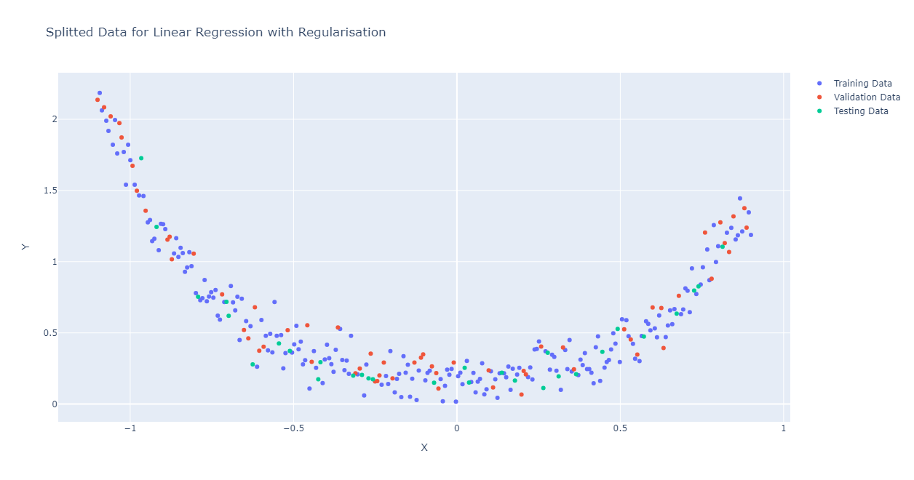

The output plots are as follows:

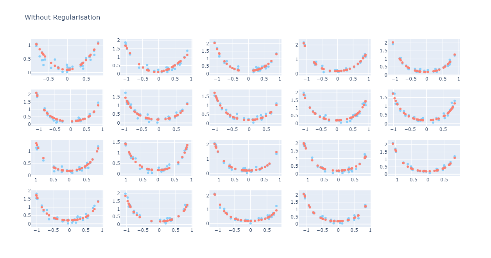

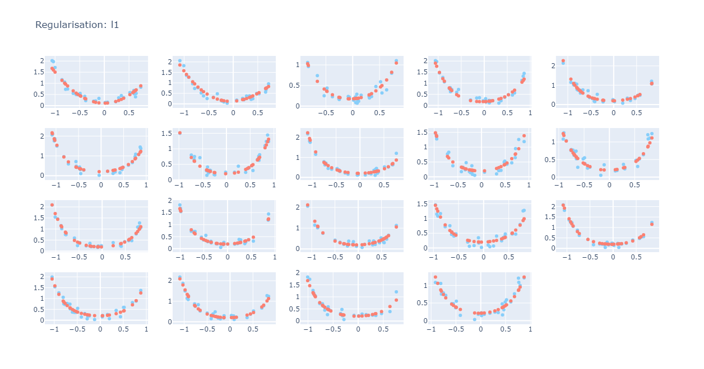

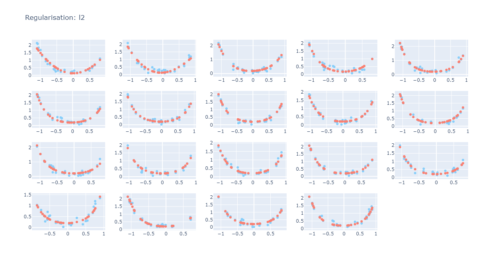

- The effect of overfitting is not very clearly visible due to some reasons
    - Training set too large and quite smooth so the curve almost fits easily
    - Range of values of X is too small for the effects of regularisation to be seen
- For the MSE, Std Dev. and Var values for this task, refer to `Reg_l1_out.csv` and `Reg_l2_out.csv`.

Remarks:
On looking at the beta values obtained during regularisation, the effects were visible - in that, the larger values of beta were being driven more and more closer to 0.

