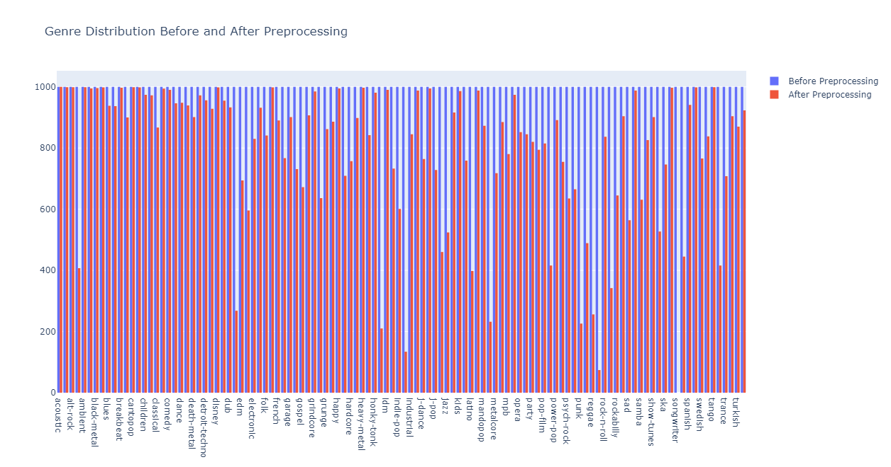

# Assignment 1 Report

## Author: Soham Vaishnav
## Roll No.: 2022112002

### 2: K-Nearest Neighbors

#### Task 1: Data Visualisation
The spotify dataset contains 114000 data points with 20 features. The features look as follows:
| Feature Name | Data Type |
|---|---|
| track_id | string |
| artists | string | 
| album_name | string |
| track_name | string |
| popularity | float |
| duration_ms | float |
| explicit | bool |
| danceability | float |
| energy | float |
| key | int |
| loudness | float |
| mode | int |
| speechiness | float |
| acousticness | float |
| instrumentalness | float |
| liveliness | float |
| valence | float |
| tempo | float |
| time_signature | int |
| track_genre | string |

Since the task is to deploy KNN for predicting music genre, the last feature becomes the label set. For the other columns, the string ones can be either removed or encoded into some numeric form for them to be useable by the model. \\
For visualisation, I have plotted the numeric features. The individual figures can be seen in `./figure`. For the combined plots, refer to the following figures:
To add a figure in the README.md file, you can use the following markdown syntax:

For some features like acousticness, instrumentalness, tempo and valence, after looking at the distribution, it felt better to represent them in the following manner as well:

|  |  | 
|---|---|

|  |  |
|---|---|

Here, we can clearly observe the effects of normalisation on the data (covered in the next section). \\
For the labels, I visualised their distribution using a histogram so as to give an idea about how to split the data into train, validation and test sets.

Some features which are binary in nature or have very less values that they can take are represented as follows:

|  |  |

|---|---|---|

Initially, all the classes were equally distributed across the datapoints and thus it did not make sense to perform stratified sampling. But if we observe the data after preprocessing, it is clear that stratified sampling is required (covered in the next section). \\

Since, we had to visualise the correlation between various features, I felt it most appropriate to generate a pair plot between features over the labels so as to give an idea of how they all are related.

The pair plot is a great way of gaining insights into the dataset:
- Intuitively, since there are 114 classes (or labels) the plots are very congested
- There is no clear separation between any two classes for any pair of features and hence the model might not deliver great performance metrics
- Duration is a feature which by looking at the plot seems to be of least importance
- Since data is too closely packed in the feature space, **Manhattan Distance** will give better results than other metrics and **Cosine Similarity** will perform the worst

#### Task 2: KNN Implementation
Followed the structure mentioned in the doc. \\
- Additionally, the class `KNN()` contains functions such as `DataSplitter()` and `DataNormaliser()` which have more to do with the model than with any data in particular. The reason for not putting the above functions in the `a1.py` is because if KNN has to be used later, these will be useful then and there. \\
- `DataNormaliser()` along with another function in `a1.py` called `DataRefiner()` help in preprocessing of the data where they collectively remove the `null` and `NaN` values and also normalise the remaining numeric values.
- The class also has another function `FindDistance()` which makes use of the distance metric set by the user and computes the distance metric which can then be used for prediction purposes. All the operations in here are vectorised to promote temporal efficiency.
- Functions such as `SetNumNeighbors()`, `GetNumNeighbors()`, `SetDistMetric()` and `GetDistMetric()` serve in the purpose of easier access and setting of hyperparameters.
- `predict()` function iterates through the rows of distance metric and finds `argmax()` of labels corresponding to the nearest k points from the train set. It makes use of the performance metrics coded in the folder `.../performance_measures` inside `confusion_matrix.py` that help calculate accuracy, macro and micro precision, recall and f1_score. Predicted values and scores are returned.

