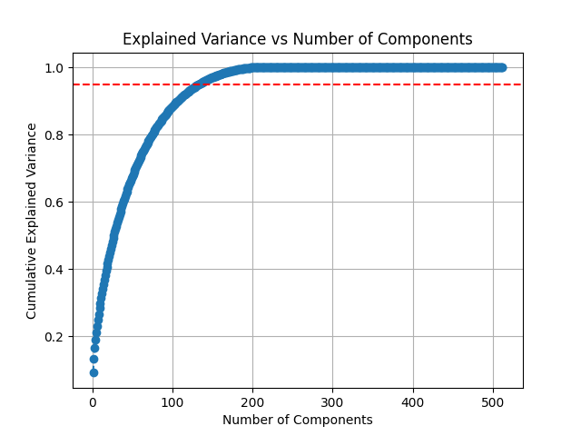

# Assignment 2 Report

## Author: Soham Vaishnav
## Roll No.: 2022112002

### 2: Dataset
The dataset `word_embeddings.feather` is a collection of 200 words each encoded using 512 features, thereby rendering a very high dimensional data. On looking at it, the dataset can be broadly classified into verbs, inanimate and animate objects.

### 3: KMeans Clustering

#### Task 1: Implementation
The `class KMeansClustering()` is present in the folder `model\kmeans\kmeans.py` which includes functions such as `setK` (set the number of clusters), `getK` (obtain the number of clusters), `InitCentroids()` (initialises the centroids using **KMeans++** algo), `getCentroids()` (returns the final set of centroids), `fit()` (uses the EM algo to iteratively find the best set of centres and clusters the data around it), `predict()` (given a datapoint, it returns the cluster it is likely to belong to), `getCost()` (finds the cost incurred by the model using WCSS method).

- The **KMeans++** algo allows us to initialise the centroids in such a manner that a major portion of the dataset is spanned by those centroids due to large distance between them. This allows for a relatively better clustering (again depends on the dataset as well) 
- For fitting the model to the dataset, I followed and implemented the standard Expectation-Maximisation algorithm

#### Task 2: kmeans1
Here, we use the elbow method to find the most optimal number of clusters that the dataset can be divided into. Refer to the plots below for two datasets:
- `word_embeddings.feather`

- `data.csv` (provided via mail)

From the above plots, we find that best number of clusters for both datasets and from both models (self and sklearn) are as follows:

| Model : dataset | kmeans1 | WCSS |
|--|--|--|
| self : word | 4 | 4206.88 |
| sklearn : word | 4 | 4049.78 |

### 4: Gaussian Mixture Models (GMMs)

#### Task 1: Implementation
The class `GaussianMixtureModel()` is present in the folder `model\gmm\gmm.py` and includes functions such as `getParams()` (returns the weights, covariance matrices and means of the gaussians), `getLikelihood()` (returns the log likelihood of the entire dataset), `getMembership()` (returns the degree to which each datapoint belongs to a particular gaussian), `InitParams()` (initialises the parameters to be used while fitting the model - more about this below), `fit()` (fits the model according to the data and returns the final set of parameters), `getClusters()` (returns the cluster that each datapoint belongs to) and `Gaussian()` (returns the multivariate gaussian pdf - however, not used).

- memberships, likelihood and parameters have been calculated according to the slides provided in class
- `InitParams()` has `init_method (str)` as an input argument which determines the way the parameters will be initialised (especially covariance matrix)
    - If `init_method = "random"`, then we randomly select the values for the parameters
    - If `init_method = "random_from_data"`, then we randomly select the values for mean from the dataset (any k datapoints), cov matrix becomes the diagonal matrix with variance of dataset and weights are uniform
    - If `init_method = "identity"`, this only applies to the covariance matrix which is initialised as identity matrix 
- `fit()` uses the EM algo to converge over user-defined epochs
    - Also uses `epsilon` as an input which prevents the denominator from going to 0 while E or M step and also regularises the covariance matrix if its values become too small. The convergence of the dataset sometimes depends on the value of epsilon

#### Task 2: Analysis, AIC/BIC and kgmm1
Here, we run the GMM over the provided 512 dimensional dataset. The GMM used here for analysis is that built by me as well as the one provided by sklearn. Following is the comparative analysis of the performance of both over some factors of the GMM:

We can observe that both are quite close in producing the log-likelihood.

Inference:
- Both the GMMs fail on the given 512 dimensional dataset - because they produce a positive log-likelihood (probability can never be > 1!). There are two reasons that I can think of:
    - The cov matrix over a high dimensional data usually tends to become singular, particularly when
    the number of features exceeds the number of datapoints. This reduces the rank of the matrix because many features are linear combination of other features thereby becoming taxing on the model. 
    - The choice of a good regularisation parameter becomes quite crucial because that by and large affects the convergence of the model 
    - Also, the way the parameters are initialised plays a role in the convergence of the model. However, I tried to take care of that as much as possible by introducing similar initial states to the sklearn GMM as I did for my class

- Both GMMs do pretty well on the `data.csv` dataset and exactly due to the reasons mentioned above. More impressive is the fact that the self-built model and the sklearn model both output nearly same parameters!

For AIC and BIC, we find the following plots:

From the above plots, it is quite difficult to infer the optimal number of clusters due to the strictly decreasing nature of the graph. However, close observation can tell that _kgmm1_ = 5.

### 5: Dimensionality Reduction and Visualisation

#### Task 1: Implementation
The class `PCA()` is present in the folder `models\pca\pca.py` and includes functions such as `getComponents()` (returns the number of components the dataset is being reduced to), `getEigenvalues()` (returns the eigenvalues of the covariance matrix), `getEigenvectors()` (returns the eigenvectors of the covariance matrix), `fit()` (finds the top k eigenvectors corresponding to the max k eigenvalues), `transform()` (transforms the original dataset by projecting it on the principal components) and `checkPCA()` (asserts whether the data has actually been reduced or not).

- Eigenvalues and eigenvectors are calculated for the covariance matrix of the dataset. The eigenvectors are a set of orthogonal vectors. 
- `fit()` selects the k eigenvectors by sorting the corresponding eigenvalues in descending order and choosing the first k out of those. 
- `transform()` takes the final k components obtained after the `fit()` step and takes the dot product of the dataset with those components thereby creating the projections of the dataset in the space spanned by the k eigenvectors.  
- `checkPCA()` performs the inverse PCA over the reduced dataset to try and obtain the original dataset as accurately as possible. 
    - this basically involves taking dot product of reduced dataset with the transpose of the matrix containing k eigenvectors. 
    - above method stems from the fact that the matrix containing eigenvectors is orthogonal which means that its dot product with its own transpose gives us an identity matrix. 

#### Task 2: Testing and Visualisation

Following are the 2D and 3D graphs of the reduced data (512 dimensional).
 

The `checkPCA()` functionality returns **False** for `n_components <= 133` due to very less retension of information (variance < 0.95). This implies, that for retaining a significant amount of information for this, we need at least 133 components.\
I used the concept which says that maximising variance (eigenvalues) is equivalent to reducing recontruction error. Where it shows that variance of around 0.95 is retained only when we keep at least 133 features. (ref. following plot)

#### Task 3: Data Analysis
The axes obtained from PCA are the eigenvectors with maximum eigenvalues of the covariance matrix of the dataset. What this means is that the axes represent the directions where, on projecting, the variance of the dataset is maximised. This helps in finding patters in the dataset which would otherwise have been suppressed in the original dimensions.

Patterns found in the data are very subtle, but I am able to broadly see that 3 categories are present - animate and inanimate objects, and verbs/actions. 

From the 2D and 3D plots shown above, we estimate optimal number of clusters for the dataset, referred to as _k2_ is **4**.

### 6: PCA + Clustering

#### Task 1: KMeans with k = _k2_
Results after performing KMeans clustering on the dataset for k = _k2_ (4) (obtained from the 2D plots in PCA):

| k | WCSS | epochs |
|--|--|--|
| 4 | 4206.88 | 10 | 

#### Task 2: PCA + KMeans
Following is the **scree plot** for the dataset:

Following is the reduced version (for a shorter range):

The optimal number of dimensions that the dataset should be reduced to is 4. The _reduced dataset_ therefore contains 4 features.

Elbow plot for the reduced dataset:

From the above plot, we find that optimal number of clusters for reduced dataset, referred to as _kmeans3_ is 5.

After performing KMeans on the reduced dataset for k = _kmeans3_, we find following results:

| k | WCSS | epochs |
|--|--|--|
| 5 | 377.42 | 10 | 

#### Task 3: GMM with k = _k2_
Results after performing GMM on the dataset for k = _k2_ (4) (obtained from the 2D plots in PCA).

| k | Log Likelihood | epochs | weights |
|--|--|--|--|
| 4 | 111940.93 | 4 | (0.01, 0.235, 0.505, 0.25) |  

#### Task 4: PCA + GMMs
Optimal number of clusters for the reduced dataset based on AIC or BIC, referred to as _kgmm3_ is 5.
For the plot, refer to earlier section dedicated to GMM.

The clusters formed after applying GMM on the reduced dataset for k = _kgmm3_ is as follows:

The performance analysis is as follows for reduced dataset.

| k | Log Likelihood | epochs |
|--|--|--|
| 4 | -2142.50 | 4 |

Clearly, as inferred earlier in PCA section, we can see 4 groups.

### 7: Cluster Analysis

#### Task 1: KMeans cluster analysis
From the above experiments, we find the following results:

| Type | Value | WCSS | epochs |
|--|--|--|
| kmeans1 | 4 | 4206.88 | 10 |
| k2 | 4 | 4206.88 | 10 | 
| kmeans3 | 5 | 377.42 | 10 |

Clearly, _kmeans3_ does better where the data does get split into similar-property-based clusters which is evident from the WCSS score that the model gives.

The clusters and the words in them can be found in `kmeans_clusters.md` (based on this the inference has been made).\
Thus, _kmeans_ = 5.

#### Task 2: GMM cluster analysis

From the above experiments, we find the following results:

| Type | Value | Log Likelihood | epochs |
|--|--|--|
| kgmm1 | 5 | -2142.50 | 4 |
| k2 | 4 | 111940.93 | 4 | 
| kgmm3 | 4 | -2142.50 | 4 |

Clearly, _kgmm3_ does better. The plot shown in one of the above sections shows how the data is split into clusters of with similar words (actions and things are getting mixed up and things are getting divided into two parts, but animals are different)

The clusters and the words in them can be found in `gmm_clusters.md` (based on this the inference has been made). \
Thus, _kgmm_ = 4.

#### Task 3: Compare KMeans and GMM
Based on the `.md` files and the plots for clusters and the words in them for kmeans and gmm, in my opinion, **KMeans** does better than **GMM**. For the following reasons:
- The animate objects are better grouped by kmeans than by gmm
- Some of the inanimate objects have been confused as animate by kmeans based on common properties like airplane is classified along with birds for its flight, whereas in gmm, the animate objects are captured relatively rightly but lesser in number than it should
- gmm has had a hard time classifying inanimate objects and thus toggles them between different clusters

NOTE: Even looking at the visualisation of the dataset, we can say that gmm would not do much better due to the high inter-relational properties of the data which makes it difficult for gmm to allocate those datapoints to a particular gaussian, thereby resulting in significant confusion.

### 8: Hierarchical Clustering
Different clustering linkages used:
- Ward: combines datapoints based on least increment in variance while adding it to and forming a cluster.
- Single: also known as minimum linkage, where the minimum distance between two clusters is taken while grouping or creating them.
- Complete: also known as maximum linkage, where the maximum distance between two clusters is taken while grouping or creating them.
- Average: as the name suggests, it uses the average of distances between all the datapoints in the clusters that are being compared to group them under a common criterion.

Different distance metrics used:
- Euclidean: the most frequently and commonly used metric while computing distance between two points
- Cosine: measures the degree of similarity between two datapoints by looking at their dot product (cosine rule)
- Cityblock/Manhattan: a simple distance calculation metric where the absolute of the difference between features constituting two datapoints is computed
- Correlation: measures the degree to which two datapoints _move together_

Following are the dendrograms for the above linkage-metrics pairs:

 

 

We see that using **ward** as linkage method and **Euclidean** as distance metric, we find better clustering (not to confuse with the output of the dendrograms). I analysed this by storing the clusters and the words in them and saw how well they are related to one-another.\
In fact, **single** works worst!

NOTE: All the linkages have been computed with distance metric as Euclidean.

The experiments have been stored as markdown files in the `data/interim/2` folder.

Now, while testing for k = {_kmeans_, _kgmm_}, I find that the clusters are better formed for k = _kmeans_ where the animate objects are all put together, actions/verbs together and the inanimate objects have been divided into those that are consumed for daily usage v/s those that are just things.

### 9: Nearest Neighbor Search 

#### Task 1: Scree plot, reduce dataset and run KNN

We see that a very sharp drop comes when we go from 1 component to 4 components and thereafter it reduces gradually. This implies, that it will be sufficient if we reduce the features of the dataset to 4. Adding more features will obviously give us more information, but will not add significant value to the results as first four would.\
Thus, I reduced the dataset to 4 components.

Another way to look at the problem is as shown in the figure above, where 95% of information of the dataset is retained in 15 features.

#### Task 2: Performance Metrics

Here is the comparison between the hyperparameters used and performance metrics of applying KNN on full dataset v/s applying it on reduced dataset:

| Hyperparams | Reduced Dataset | Full Dataset |
|--|--|--|
| k | 15 | 15 |
| dist_metric | l1 | l1 |
| features | 4 | 18 |

On the Validation set:

| Metrics | Reduced Dataset | Full Dataset |
|--|--|--|
| Accuracy | 16.25 | 36.88 |
| Precision_Macro | 0.1527 | 0.3579 |
| Precision_Micro | 0.1625 | 0.3688 |
| Recall_Macro | 0.1489 | 0.3366 |
| Recall_Micro | 0.1625 | 0.3688 |
| F1_Macro | 0.1508 | 0.3469 |
| F1_Mirco | 0.1625 | 0.3688 |
| inference time (seconds) | 40.04 | 96.36 |

On the Test set:

| Metrics | Reduced Dataset |
|--|--|
| Accuracy | 15.49 |
| Precision_Macro | 0.1485 |
| Precision_Micro | 0.1549 |
| Recall_Macro | 0.1427 |
| Recall_Micro | 0.1549 |
| F1_Macro | 0.1455 |
| F1_Mirco | 0.1549 |
| inference time (seconds) | 38.27 |

We find significance difference in the performance metrics. However, the difference is also highlighted in the inference time taken by the model - reduced to almost less than half!

The reason for the dip in performance measures is that the information content present in first few components is, although a lot as compared to the content in remaining components, is not enough for the model to draw all insights about the data. For instance, if we increase the number of principle components to 9, we see that the accuracy becomes around 26.5%. From this we can deduce that the amount of rise in accuracy that the first 4 components can give is much more (16%) than the improvement that the next 4 can provide (10%). \
This observation is in line with what we had observed in the `a1`, where, removing certain components drastically affected the model performance.