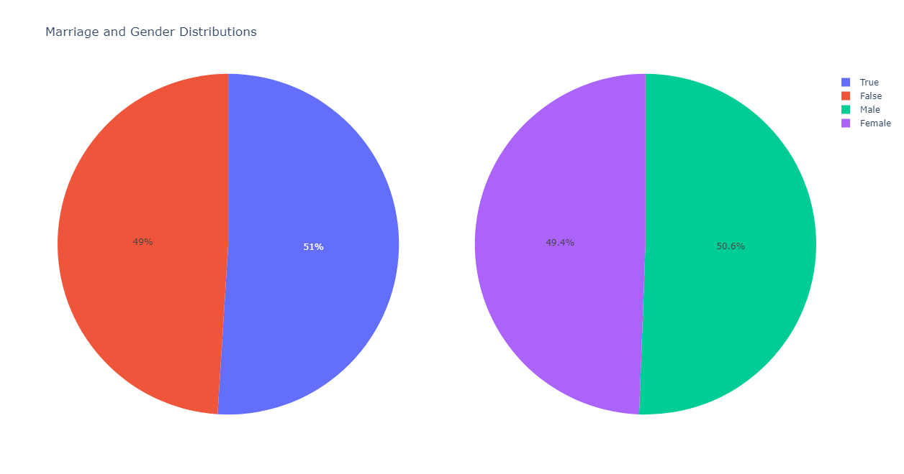

# Assignment 2 Report

## Author: Soham Vaishnav
## Roll No.: 2022112002

### 2: Multi Layer Perceptron Classification

#### Task 1: Data Analysis and Preprocessing
The dataset `WineQT.csv` is a dataset of wine quality ratings. It contains 13 features and a target variable `quality` which ranges from 3 to 8. Following is the visualisation of the features of the dataset, their internal relationships and the dependence of the target variable on the features.

Observations:
- The features `fixed acidity`, `volatile acidity`, `citric acid`, `residual sugar`, `chlorides`, `free sulfur dioxide`, `total sulfur dioxide`, `density` and `pH` have a roughly exponential relationship with the target variable.
- The features `alcohol` and `sulphates` have a roughly linear relationship with the target variable.
- The dataset is imbalanced with respect to the target variable - there are more samples for lower quality wines and fewer samples for higher quality wines.
- The data is quite congested in the lower half of the feature space, thereby, making classification a challenging task. 

For preprocessing, I have used the `DataPreprocess()` function in `a3.py` which performs the following tasks:
- Checks for null values and removes them.
- Standardises the data so that the mean of each feature is 0 and the standard deviation is 1.
- Splits the data into training and testing sets (80-20 random split).

#### Task 2: Model Building from Scratch
The model has been implemented in `models/MLP/mlp.py`, the features of which are as follows:
- The model has functions such as `add()` (adds a layer to the model), `fit()` (initialises weights and biases and fits the model to the training data), `train()` (trains the model on the training data), `predict()` (predicts the target variable for the test data) and `evaluate()` (evaluates the model on the test data), `loss()` (calculates the loss between the predicted and actual values) and `backprop()` (calculates the gradients of the loss function with respect to the weights and biases), `forward()` (performs a forward pass through the network). 
- The model also uses the `Optimizer` that includes functions such as `sgd()` (stochastic gradient descent), `bgd()` (batch gradient descent) and `mini_bgd()` (mini-batch gradient descent).
- Another helper class `Layers()` is used to store the architecture of the network such as the number of units in each layer and the activation function to be used. 
- The loss function used is cross-entropy and the activation function used in the last layer is softmax.
- To initialise the model, a config file is used which contains all the hyperparameters of the model.
- Weights are initialised using the Xavier method and biases are initialised to 0.
- Inside the `MultiLayerPerceptron_SingleClass()` class, a numerical gradient method has also been implemented to check the analytical gradients. The validity of gradients calculated by backprop method is checked using the norm of the gradients calculated analytically and numerically.

#### Task 3: Hyperparameter Tuning using W&B
GOING ON....

#### Task 4: Evaluation of best model
GOING ON....

#### Task 5: Analysing hyperparameter effects
##### Task 5.1: Effect of Non-linearity
##### Task 5.2: Effect of Learning Rate
##### Task 5.3: Effect of Batch Size

#### Task 6: Multi-label Classification
The dataset used here is `advertisement.csv` which contains the information of some 1000 individuals and the kinds of products they have purchased as well as the categories of the products that highlights the kind of advertisement they are most likely to click on.

Here is a visualisation of the multiple features of the dataset:
 

 
 
 
 

The above plots present the demographic information of the individuals and the kind of products they have purchased. They also show the dependence of items bought (and therefore the ads seen) on the gender of the individual, their education and occupation.

For the model, I have used the `MultiLayerPerceptron_MultiClass()` class in `models/MLP/mlp_multi.py` which is similar to the `MultiLayerPerceptron_SingleClass()` class but with the following differences:
- The number of units in the last layer is equal to the number of classes.
- The activation function used in the last layer is softmax.
- The loss function used is binary cross-entropy.

Rest everything is the same as in the single label classification case.

##### Hyperparameter Tuning
GOING ON....

##### Evaluation of best model
GOING ON....

#### Task 7: Analysis 
For each datapoint, the model predicts the probabilities of the datapoint belonging to each of the classes. The class with the highest probability is the predicted class (in case of single label classification). Whereas, in case of multi-label classification, the model predicts the probabilities of the datapoint belonging to each of the classes and the datapoint is predicted to belong to all the classes for which the probability is greater than some threshold (passed as a hyperparameter). Following analysis is found:

REMAINING....

### 3: Multi Perceptron Regression

### 4: Autoencoder