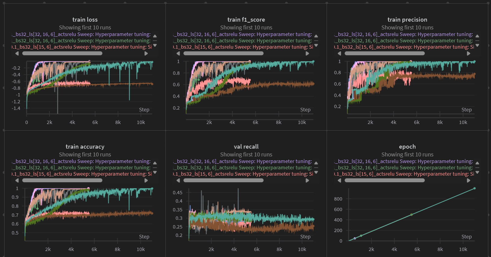
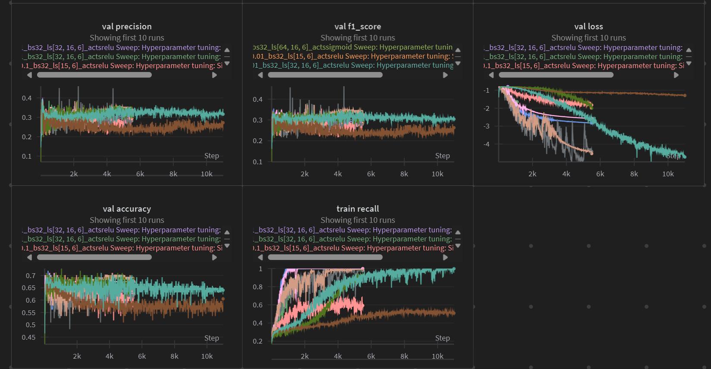
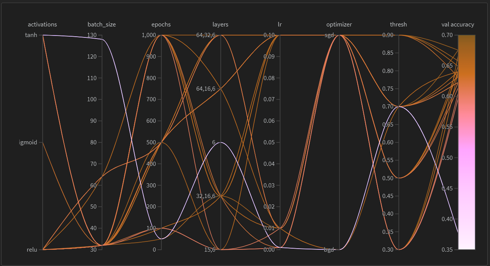
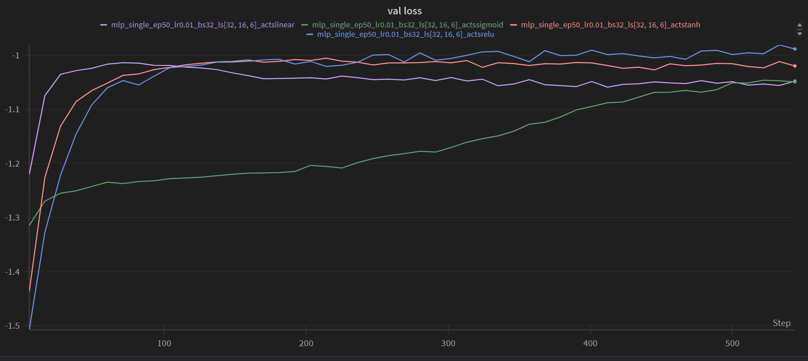
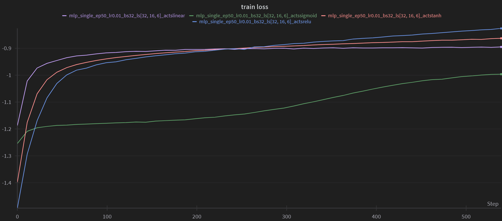
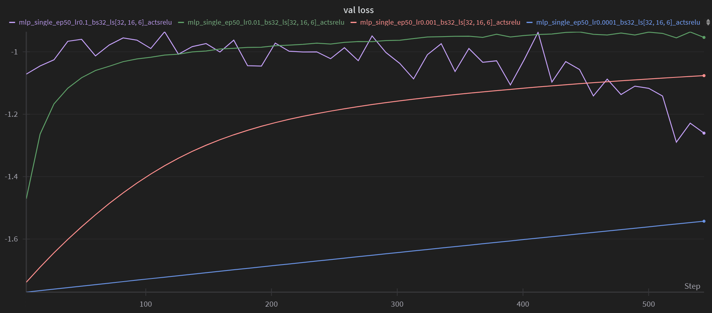
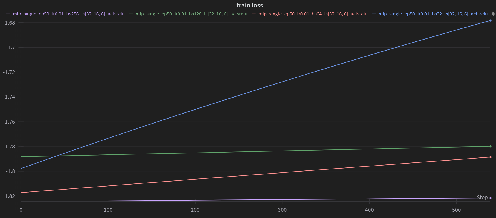
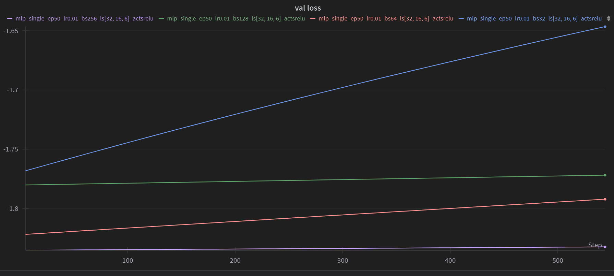
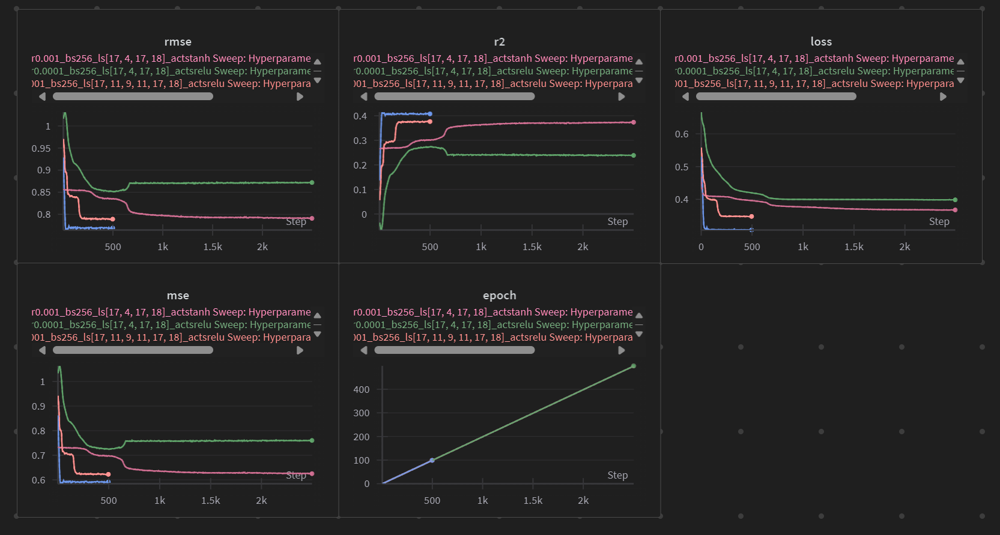
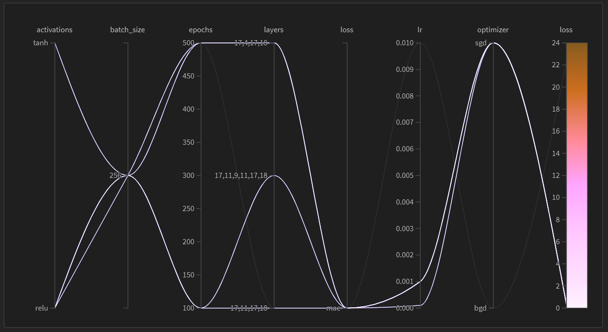

# Assignment 2 Report

## Author: Soham Vaishnav
## Roll No.: 2022112002

### 2: Multi Layer Perceptron Classification

#### Task 1: Data Analysis and Preprocessing
The dataset `WineQT.csv` is a dataset of wine quality ratings. It contains 13 features and a target variable `quality` which ranges from 3 to 8. Following is the visualisation of the features of the dataset, their internal relationships and the dependence of the target variable on the features.

Observations:
- The features `fixed acidity`, `volatile acidity`, `citric acid`, `residual sugar`, `chlorides`, `free sulfur dioxide`, `total sulfur dioxide`, `density` and `pH` have a roughly exponential relationship with the target variable.
- The features `alcohol` and `sulphates` have a roughly linear relationship with the target variable.
- The dataset is imbalanced with respect to the target variable - there are more samples for lower quality wines and fewer samples for higher quality wines.
- The data is quite congested in the lower half of the feature space, thereby, making classification a challenging task. 

For preprocessing, I have used the `DataPreprocess()` function in `a3.py` which performs the following tasks:
- Checks for null values and removes them.
- Standardises the data so that the mean of each feature is 0 and the standard deviation is 1.
- Splits the data into training and testing sets (80-20 random split).

#### Task 2: Model Building from Scratch
The model has been implemented in `models/MLP/mlp.py`, the features of which are as follows:
- The model has functions such as `add()` (adds a layer to the model), `fit()` (initialises weights and biases and fits the model to the training data), `train()` (trains the model on the training data), `predict()` (predicts the target variable for the test data) and `evaluate()` (evaluates the model on the test data), `loss()` (calculates the loss between the predicted and actual values) and `backprop()` (calculates the gradients of the loss function with respect to the weights and biases), `forward()` (performs a forward pass through the network). 
- The model also uses the `Optimizer` that includes functions such as `sgd()` (stochastic gradient descent), `bgd()` (batch gradient descent) and `mini_bgd()` (mini-batch gradient descent).
- Another helper class `Layers()` is used to store the architecture of the network such as the number of units in each layer and the activation function to be used. 
- The loss function used is cross-entropy and the activation function used in the last layer is softmax.
- To initialise the model, a config file is used which contains all the hyperparameters of the model.
- Weights are initialised using the Xavier method and biases are initialised to 0.
- Inside the `MultiLayerPerceptron_SingleClass()` class, a numerical gradient method has also been implemented to check the analytical gradients. The validity of gradients calculated by backprop method is checked using the norm of the gradients calculated analytically and numerically.

#### Task 3: Hyperparameter Tuning using W&B
Following are the results of the hyperparameter tuning:

The sweep results based on the above plots are:

Based on the above results, the best set of hyperparameters are:

|Learning Rate|Epochs|Batch Size|Optimizer|Hidden Layers|Activation Functions|
|:-----------:|:----:|:--------:|:-------:|:------------:|:-------------------:|
|0.01|50|32|sgd|Three - [32, 16, 6]|[relu, relu, softmax]|

A table containing the HPT results has been put under the `data\internals\3` folder (it is a little large to be displayed here).

#### Task 4: Evaluation of best model
Using the best set of hyperparameters, the model has been evaluated on the valid and test datas. The results are as follows:

For validation set:

|Loss|Accuracy|Precision|Recall|F1 Score|
|:---:|:------:|:-------:|:----:|:------:|
|0.80109|0.66667|0.30242|0.29478|0.29856|

For test set:

|Loss|Accuracy|Precision|Recall|F1 Score|
|:---:|:------:|:-------:|:----:|:------:|
|1.00648|0.56522|0.29352|0.27518|0.28406|

#### Task 5: Analysing hyperparameter effects

##### Task 5.1: Effect of Non-linearity

Validation Loss vs Epochs

Training Loss vs Epochs

##### Task 5.2: Effect of Learning Rate

Training Loss vs Epochs

Validation Loss vs Epochs

##### Task 5.3: Effect of Batch Size

Training Loss vs Epochs

Validation Loss vs Epochs

Observations:
- We see that the model is quite sensitive to the learning rate. A learning rate that is too high causes the model to diverge and also overfit. Whereas, a learning rate that is too low causes the model to converge too slowly.
- The model is quite sensitive to the activation functions used - using relu as the activation function for the hidden layers and softmax in the last layer gives the best results. Sigmoid convergence is the slowest and tanh is faster than relu.
- The model is also sensitive to the batch size - using a batch size of 1 is equivalent to using stochastic gradient descent and using a batch size equal to the training set size is equivalent to using batch gradient descent. Using a mini-batch gradient descent with an optimal batch size gives faster convergence than using stochastic gradient descent. However, on the downside, the change in loss is not much significant for each epoch. 

#### Task 6: Multi-label Classification
The dataset used here is `advertisement.csv` which contains the information of some 1000 individuals and the kinds of products they have purchased as well as the categories of the products that highlights the kind of advertisement they are most likely to click on.

Here is a visualisation of the multiple features of the dataset:
 

 
 
 
 

The above plots present the demographic information of the individuals and the kind of products they have purchased. They also show the dependence of items bought (and therefore the ads seen) on the gender of the individual, their education and occupation.

For the model, I have used the `MultiLayerPerceptron_MultiClass()` class in `models/MLP/mlp_multi.py` which is similar to the `MultiLayerPerceptron_SingleClass()` class but with the following differences:
- The number of units in the last layer is equal to the number of classes.
- The activation function used in the last layer is softmax.
- The loss function used is binary cross-entropy.

Rest everything is the same as in the single label classification case.

##### Hyperparameter Tuning
GOING ON....

##### Evaluation of best model
GOING ON....

#### Task 7: Analysis 
For each datapoint, the model predicts the probabilities of the datapoint belonging to each of the classes. The class with the highest probability is the predicted class (in case of single label classification). Whereas, in case of multi-label classification, the model predicts the probabilities of the datapoint belonging to each of the classes and the datapoint is predicted to belong to all the classes for which the probability is greater than some threshold (passed as a hyperparameter). Following analysis is found:

REMAINING....

### 3: Multi Perceptron Regression

#### Task 1: Data Analysis and Preprocessing
The dataset used here is `HousingData.csv` which contains the information of some houses and their prices based on various features. The prices are the target variable, stored under the column `MEDV` - median value of owner-occupied homes in $1000s. Following is the visualisation of the features of the dataset:

Observations:
- The features `CRIM`, `ZN`, `INDUS`, `CHAS`, `NOX`, `RM`, `PTRATIO`, `LSTAT` have a roughly exponential relationship with the target variable.
- The feature `RAD` has a roughly linear relationship with the target variable.
- The dataset is not imbalanced.
- Some features have outliers which may affect the performance of the model.
- Features like `CHAS` and `RAD` are categorical in nature, and `PTRATIO` is discrete. Classifying prices based on these features may not be the best idea.
- Some features have a very high correlation with each other - `RAD` and `TAX`, `ZN` and `INDUS`, `LSTAT` and `RM`.
- Features like `RM` and `LSTAT` have a high co-relation with the target variable.

#### Task 2: Model Building from Scratch
The model `MultiLayerPerceptron_Regression()` is implemented in `models/MLP/mlp_reg.py` and is similar to the `MultiLayerPerceptron_SingleClass()` class but with the following differences:
- The number of units in the last layer is 1.
- The activation function used in the last layer is linear.
- The loss function used is mean squared error. 
- Other loss functions like Binary Cross Entropy, Maximum Absolute Error, etc., have also been implemented.
- The metrics used are MSE, RMSE, R2 Score as opposed to accuracy, precision, recall and f1 score in classification.

Rest all remains the same.

#### Task 3: Hyperparameter Tuning using W&B
GOING ON....

#### Task 4: Evaluating Model
GOING ON....

#### Task 5: Mean Squared Error v/s Binary Cross Entropy
I find that the Mean Squared Error is a better loss function than the Binary Cross Entropy for this dataset as the Binary Cross Entropy is not a convex function and may cause the model to get stuck in a local minima.\
Also, the Mean Squared Error penalises the model more for the errors in prediction, thereby, making it more sensitive to the errors in prediction. This is evident from the plots of the loss functions.\
Another reason is that the target variable is continuous and not categorical, therefore, the Binary Cross Entropy is not the best suited loss function and therefore, BCE generally tends to blow up (the log terms become too large and cause overflow).\
It is therefore better to use loss functions such as MSE or MAE that are more suited for continuous target variables unlike BCE which is more suited for categorical target variables.

#### Task 6: Analysis 
REMAINING....

### 4: AutoEncoder

#### Task 1: Autoencoder Implementation from scratch
The autoencoder is implemented in `models/MLP/autoencoder.py` and uses the baseline model class of `MultiLayerPerceptron_Regression()`. The implementation is similar to that of the regression model but with some differences:
- The model is used for dimensionality reduction and not for prediction.
- The number of units in the last layer is the same as the number of features in the dataset.
- The middle-most layer is used for encoding the data and the last layer is used for decoding the data.
- The number of units in the middle-most layer is the same as the number of features desired in the reduced dataset.
- The activation function used in the last layer is sigmoid (because it is a regression model).
- The loss function used is MSE and MAE, and the same metrics are used to evaluate the model.
- The model has functions such as `get_latent()` (returns the latent space representation of the data) and `evaluate()` (evaluates the model on the data).

Rest everything is the same.

#### Task 2: Training an Autoencoder
I trained the autoencoder on the `spotify` dataset (from a1). To find out the best set of hyperparameters, I sweeped over the required hyperparameters using W&B. Following are the results of the same:

and 

From the above plots, it is evident that the best set of hyperparameters are:

|Learning Rate|Epochs|Batch Size|Optimizer|Loss Function|Hidden Layers|Activation Functions|
|:-----------:|:----:|:--------:|:-------:|:------------:|:------------:|:-------------------:|
|0.001|100|256|sgd|MAE|Three - [17, 11, 17]|[relu, relu, relu]|

