# Assignment 5
Author: Soham Vaishnav \
Roll No.: 2022112002

## Task 1 - Kernel Density Estimation (KDE)
### Creating Dataset
1. I created the dataset by randomly sampling from a circular distribution of points by estimating the radius of the circles as shown in the desired dataset plot.
    - This has been implemented in the function `getData()` in `a5.py` which also takes the kind of source distribution that the points need to be sampled from - circular or gaussian (haven't used because does not give nice data).
2. Using the above method, I get the following distributions:
    - Sampling from circular distribution
    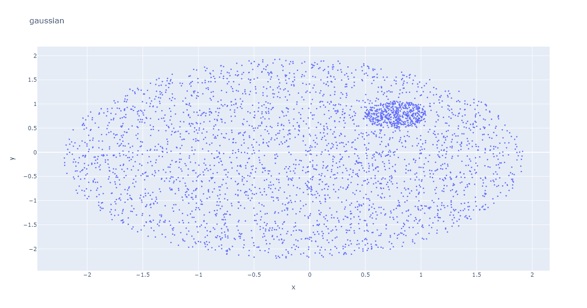

### Implementing KDE class
The `class KDE()` has been implemented in `models/kde/kde.py` which has the following functions:
1. `buildKernel()` which initialises the desired kernel by calling the kernel functions such as: `gaussianKernel()`, `triangularKernel()` and `boxKernel()`.
2. `fit()` method which scans through the data and creates kernels at all datapoints positions. It returns the kernel density estimation at each point in the dataset.
3. `predict()` function takes in a point and returns the KDE value at that point.
4. Other helper plotting functions that make it easy to visualise the dataset and KDE.

### Results:
The following are the results for KDE plots for different kinds of kernels:
1. Triangular Kernel
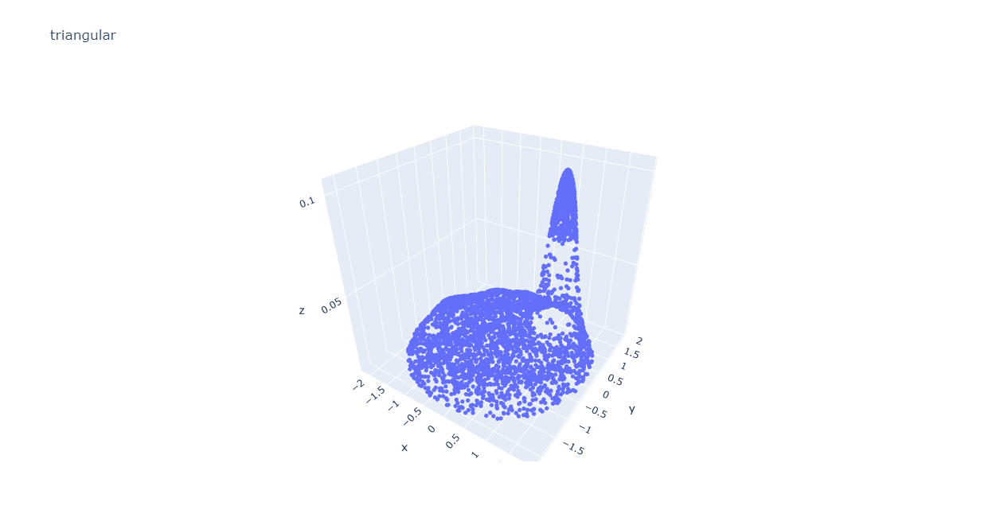
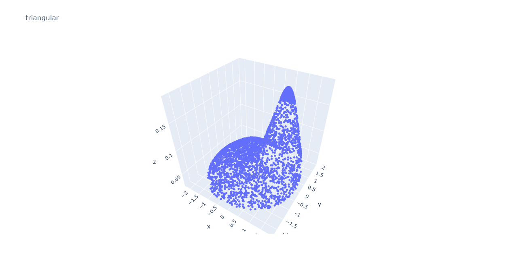

2. Gaussian Kernel
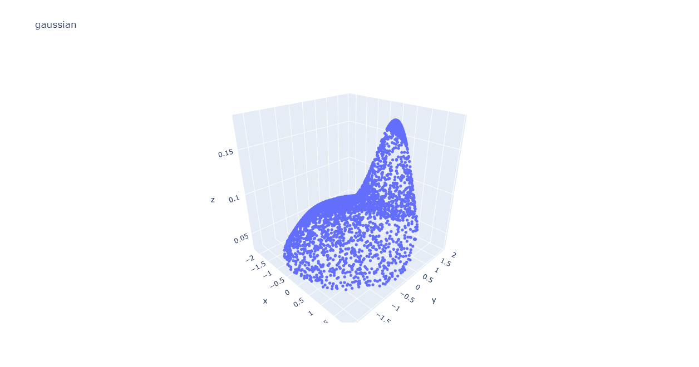
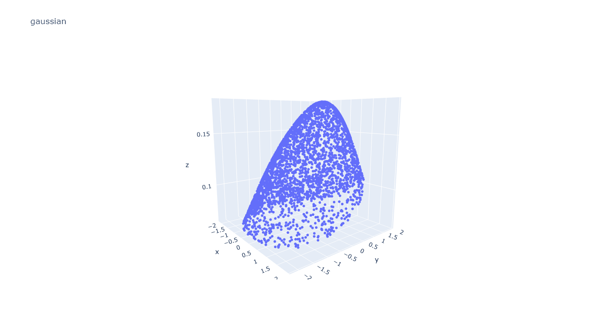

3. Box Kernel
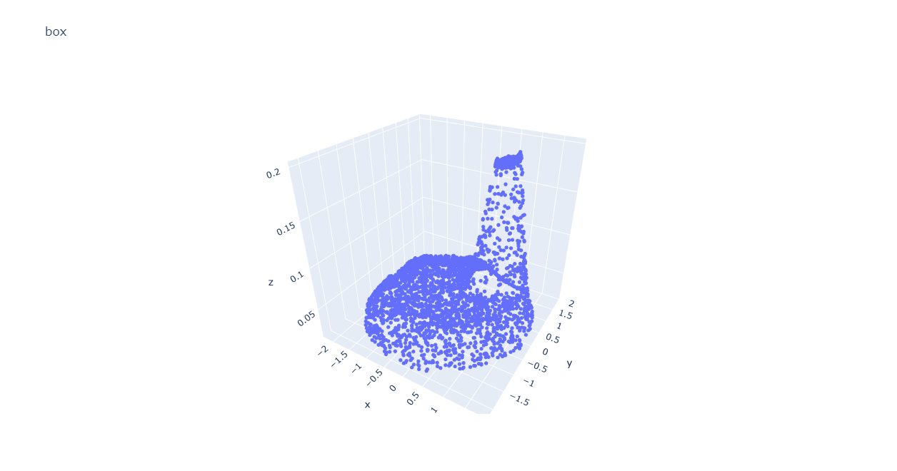
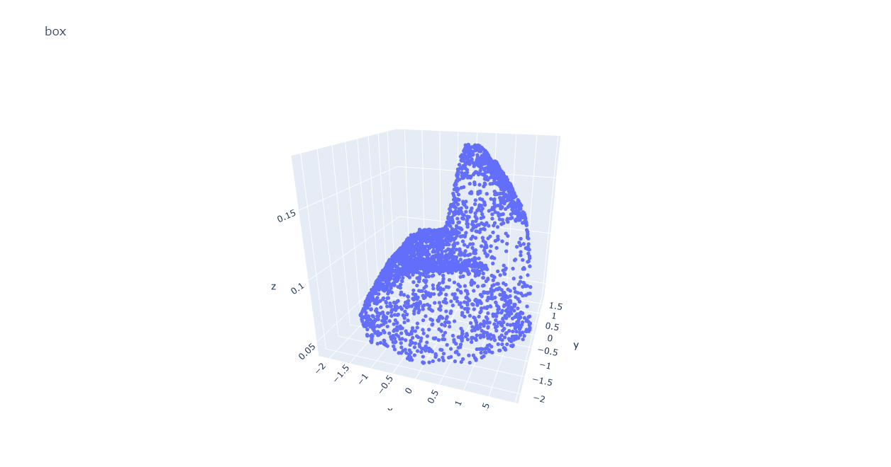

### Comparing with GMM
Membership plot for GMm:
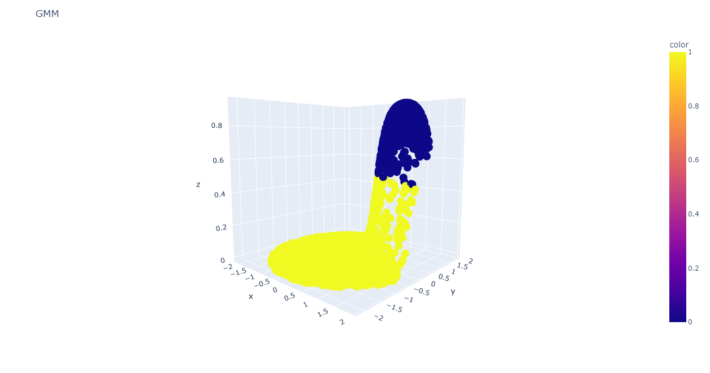

Comparing GMM and KDE:
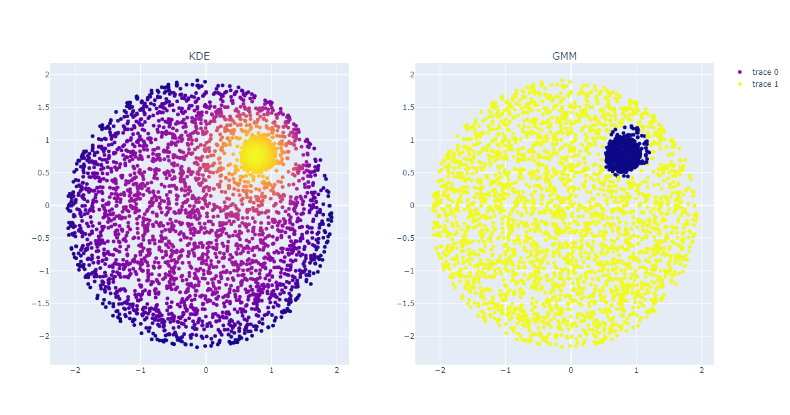
and, 
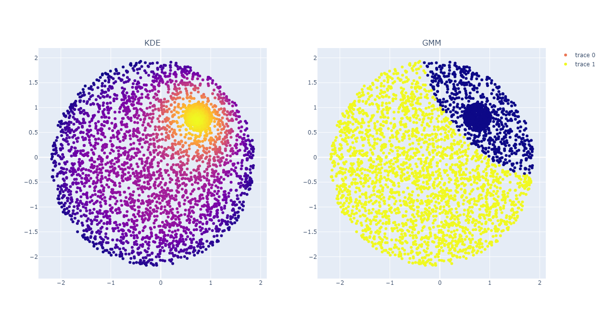

The plots clearly show how GMM tried to find global gaussian functions that can capture the distribution of the dataset. Whereas, KDE is a summation of multiple gaussians (if that is chosen as the kernel type) and therefore is able to capture the distribution in a much better way.

## Task 2 - Hidden Markov Models (HMMs)
### Visualising the MFCC of the audios
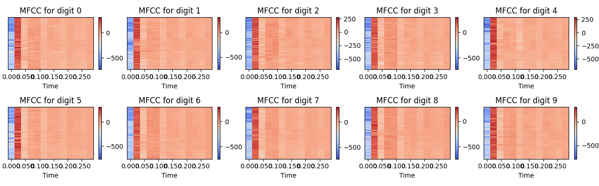
Observations:\
I find that the mfcc of each digit captures a certain kind of information content present in the audio and generates a spectrogram. Now, we observe that regardless of the digit, the most information is concentrated in the first few time instances in the audio which denotes that for each digit, while speaking, the idea of what that digit can be is indicated by the middle information. \
Furthermore, each such array has a unique spike-like pattern that encodes the phoenetics of the digit being spoken. 

This suggests that MFCC is indeed an insightful way to visualise and process audio data, and perhaps the model is learning the temporal as well as phoenetic correlations within the mfcc(s) of each digit.

### Implementing the Model
The model has been implemented as `class HMM()` in `models/hmm/hmm.py` which has the following functions:
1. `buildHMM()` which initiates the model from `hmmlearn` with required hyperparameters
2. `fitHMM()` which trains the hmm model for the given data
3. `predictHMM()` which predicts a digit for the given mfcc
4. `save()` which saves the hmm model in a file to be used later.

### Method for training
I divided the dataset into train and test sets with 80:20 split. This was followed by distribution of audio files in their respective digit folders so that training and testing become easy. \
While loading the data, I extracted the mfccs from the audio files and stored them digitwise in a dictionary `mfcc_digit_pairs`. 

### Results:
After training the HMM on the train set, I obtain the following set of metrics:
| Set | Accuracy (%) |
|-----|----------|
| Train | 91.0204 |
| Test | 90.0 |

After testing on self-generated audio, I get an accuracy of **10.0%**.

## Task 3 - RNNs
This task has been done entirely in `RNN.ipynb` in `assignments/5`. The model `class BitCounterRNN()` has been written in `models/rnn/rnn.py` and is has functions such as `forward()`, `predict()`, `fit()` and `evaluate()`, the usecase of which is exactly same as in traditional torch models. There is a also a `save_model()` function for saving the best model. \
A version of the best model has been saved in the folder `assignments/5` with the name `RNN_best_model_1.pth`. \
Further descriptions are in the notebook itself.  